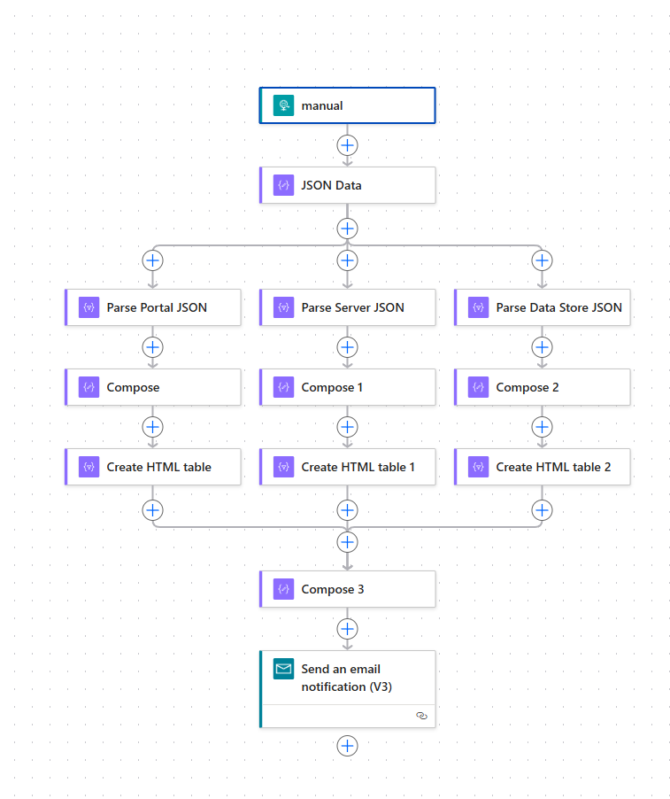
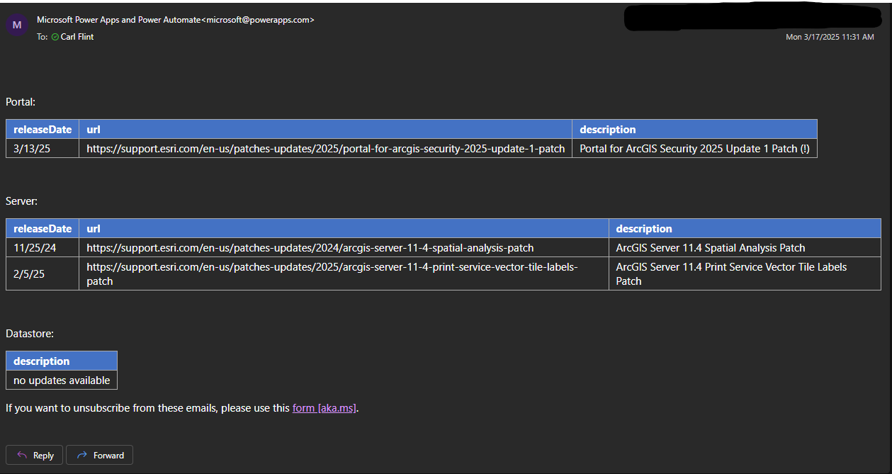

# Patch Notification Alerts

v1.0.0

---

Using the ArcGIS Enterprise Patch Notification Utility

Parse output and leverage a Power Automate Flow to send an email alert when a new patch is available for ArcGIS Enterprise.

---

### Setup

Download the repo and extract the contents to a local directory.

Navigate to Power Automate go to My Flows.

Import package (Legacy)

- Select the patch_notification_flow.zip file and import to Power Automate.

Begin import setup

- Import Setup

>- Name: Http -> Send an email (v2)
>- Create as new
>- Provide Resource Name

>- Name: Mail
>- Select during import
>- Create new mail connection

Import

Diagram of Power Automate Flow for parsing and formatting the patch notification information to send an email alert.

---

Get webhook URL from flow

- Held in the manual element at the top of the flow.

Make an environment variable on the machine that will run the script (PATCH_NOTIFICATION_WEBHOOK_URL) or hardcode the URL at the $webhookURL variable.

Script can be ran ad-hoc or scheduled via Task Scheduler.

---

Example output of the Power Automate Flow as an email with available patches based on the Patch Notification output.

