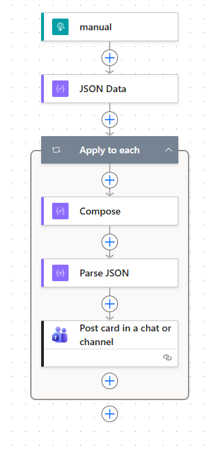
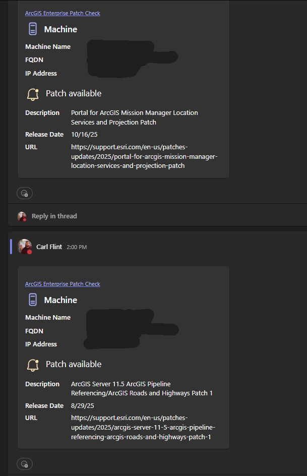

# Patch Notification Alerts

v1.0.1

---

Using the ArcGIS Enterprise Patch Notification Utility

Parse output and leverage a Power Automate Flow to send an email alert when a new patch is available for ArcGIS Enterprise.

---

### Setup

Download the repo and extract the contents to a local directory.

Open Power Automate and navigate to My Flows.

Import package (Legacy)

- Select the patch_notification_flow.zip file from the local directory and import to Power Automate.

Begin import setup

- Import Setup

Import and configure with ArcGIS Connector and your desired Trigger format if not using a manual trigger as the example below.

Example diagram of Power Automate Flow for sending adaptive cards to Microsoft Teams.

---

Get webhook URL from flow

- Held in the manual element at the top of the flow.

End user assignable variables are at the top of the `notify2webhook.ps1` script.

Specify a `Role` that matches one of the components installed on the machine the script will run on. Options are:
- Portal
- Server
- Datastore

Make an environment variable on the machine that will run the script (PATCH_NOTIFICATION_WEBHOOK_URL) or hardcode the URL at the $webhookURL variable.

Script can be ran ad-hoc or scheduled via Task Scheduler.

---

Example output in MS Teams with adaptive cards

